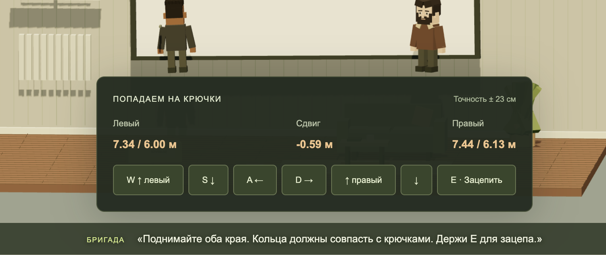

# Комната: фотографии и замечания пользователя

Перенесено 12 сентября 2026 из чата «Релиз capacity 128» по просьбе Никиты. Это материалы для игры к возвращению друга, не для проекта DODO. Оригиналы скопированы без обработки, побайтовое совпадение проверено. Здесь восемь присланных фотографий (две одинаковые) и один скриншот игры.

## Что пользователь попросил учесть

- Это одна комната: кухня, диван, компьютерный стол и кресло. Важны взаимное расположение и узнаваемые предметы; бардак воспроизводить не обязательно.
- Большая панель управления этапом подвешивания экрана перекрывает обзор. Само действие должно оставаться видно.
- Игры можно сделать примерно в 2–3 раза сложнее; это пожелание к доработке, а не уже реализованное изменение.
- При регулировке высоты и подвешивании экрана персонажи не должны летать. Они стоят на полу и поднимают экран за нижний край. Это замечание именно к подъёму экрана, не к этапу сверления со стульями.

## Наблюдения по фото

Вытянутая кухня-гостиная: большой экран с чёрной рамкой на стене, под ним длинная низкая деревянная тумба. Напротив тёмный угловой диван; между ними проход. Кухня на одном конце помещения: холодильник, светлые шкафы, рабочая поверхность, стол и зелёные стулья. В другой части у окна компьютерный стол с монитором, ноутбуком и офисным креслом. Есть отдельное мягкое кресло, длинные серые шторы, чёрный вертикальный радиатор и кондиционер. Светлые стены, деревянный пол, потолочные светильники и чёрные подвесы. Точные размеры по фотографиям не определены.

## Фотографии

1. [Экран и тумба, общий вид](codex-clipboard-0f8a312e-5d8e-454d-9637-70a9518652cd.jpg)
2. [Экран сбоку и тумба](codex-clipboard-75f75ad3-b900-4d7e-9509-78d488c16e72.jpg)
3. [Экран, проход и кухня](codex-clipboard-fdafd102-9c29-4263-8f6e-e149238cba4f.jpg)
4. [Общий вид: диван напротив экрана, кухня в глубине](codex-clipboard-5c413cd6-7eae-49ce-9c7c-d9d56f159b94.jpg)
5. [Повтор фотографии 4, сохранён как прислан](codex-clipboard-d015b182-dbc1-4950-8306-4dee8ce4c7b4.jpg)
6. [Кухня, стол, зелёные стулья, холодильник и шторы](codex-clipboard-dd5f9631-5b0f-4fe1-911b-ea14c44378d8.jpg)
7. [Проход рядом с экраном и дверь](codex-clipboard-69007869-db30-4d84-92b0-fe6c3c67ac80.jpg)
8. [Рабочий стол у окна, офисное кресло, диван и кондиционер](codex-clipboard-0c095656-8d63-4947-ab61-bd3964f9d550.jpg)

## Проблема в игре

Исходные фото оставлены в `references`, не в публичных ресурсах сайта. Эта передача материалов сама по себе не меняет игру и не публикует фотографии.
